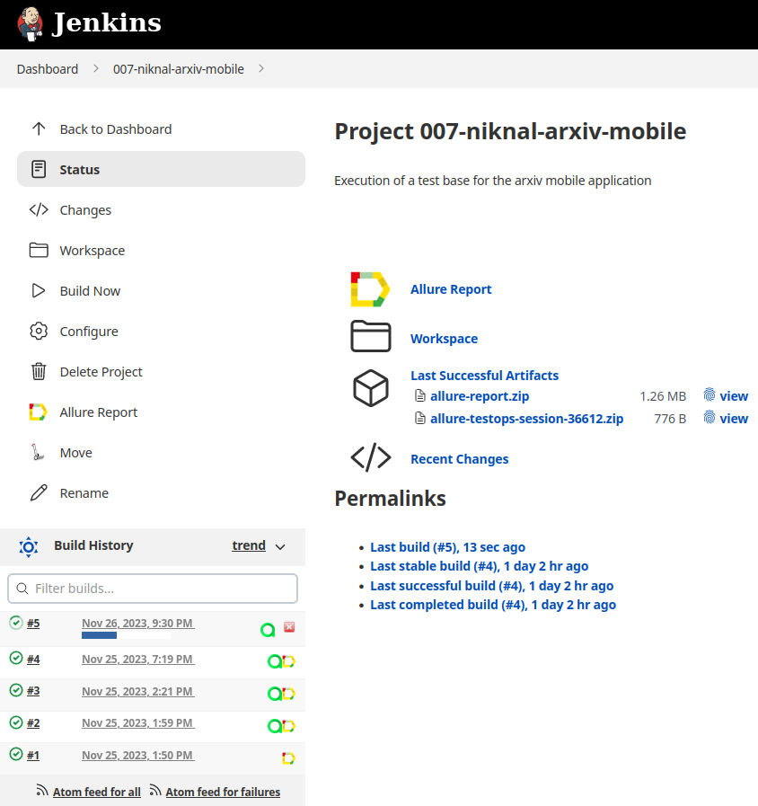
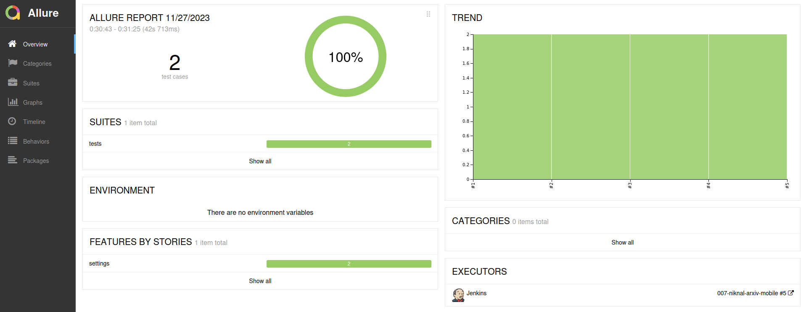
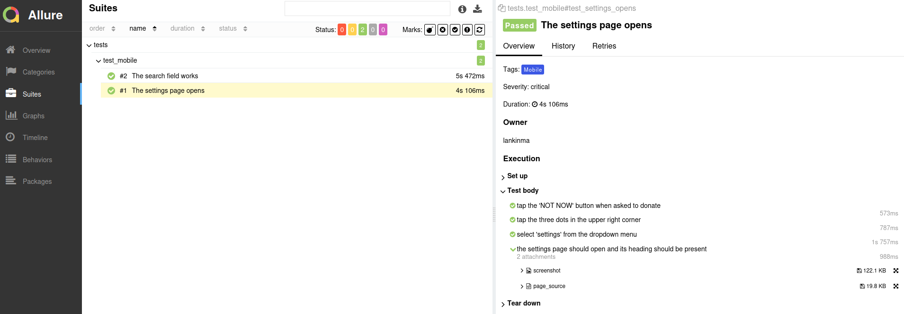
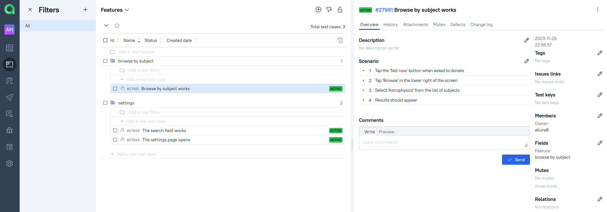
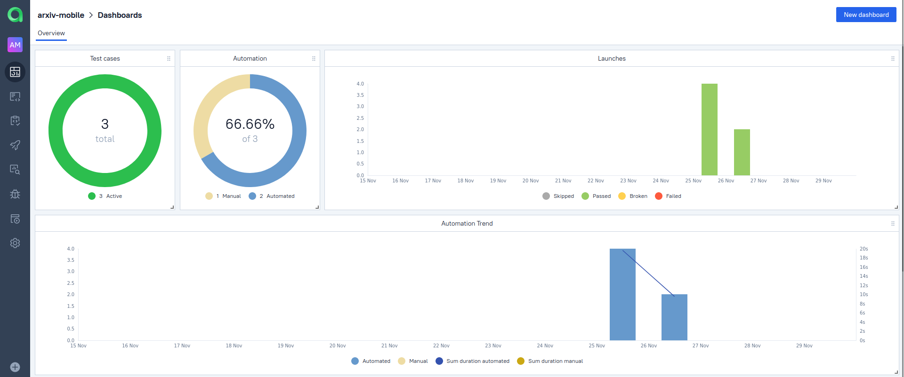

# A SAMPLE TEST BASE FOR THE [ARXIV EXPLORER](https://github.com/GarrettBeatty/arXiv-eXplorer) APP

ArXiv is a website that has been allowing free access to scientific articles in certain fields since the beginning of 1990s. ArXiv eXplorer is an Android app for the site which you can download [here](https://f-droid.org/en/packages/com.gbeatty.arxiv/). 

   

In a nutshell:


## Covered functionality:

- The first page of the mobile app
- Basic search

A [separate project](https://github.com/rattus-aristarchus/test-arxiv) hosts tests for the arXiv site itself.

## Tech stack:


## Local execution

To run the tests locally, do the following:

- clone the remote repository `https://github.com/rattus-aristarchus/test_arxiv_mobile.git`
- create an `.env` file with environment variables. The file should contain the following variables:
```
BROWSERSTACK_LOGIN=your login for browserstack 
BROWSERSTACK_PASSWORD=your password for browserstack
```
- execute the following commands in the root folder of the project:
```sh
python -m venv .venv
source .venv/bin/activate
pip install poetry
poetry update
pytest tests
```


##  Remote execution

There is a [Jenkins](https://jenkins.autotests.cloud/job/007-niknal-arxiv-mobile/) project that can execute tests stored in this repository. To run the tests:
- open the project
- click "Build Now"



### Allure Report

The Jenkins project is integrated with Allure Report. Once the job has run, it creates a link to the report:



The "Suites" tab has a detailed representation of how each test was executed, with steps, attachments, etc.




### Allure Testops

The Jenkins project is also integrated with an [Allure Testops project](https://allure.autotests.cloud/project/3848/dashboards), which stores test results for all previous launches of the project. Why would we need that? 

- to have manual and automated test cases in the same interface, showing their collective coverage of features:


- to have defects that help categorize and quickly sort test failures:


- to have aggregated statistics on test runs:


### Jira

The Allure Testops project is integrated with Jira. Issues are linked to test cases in Testops.


