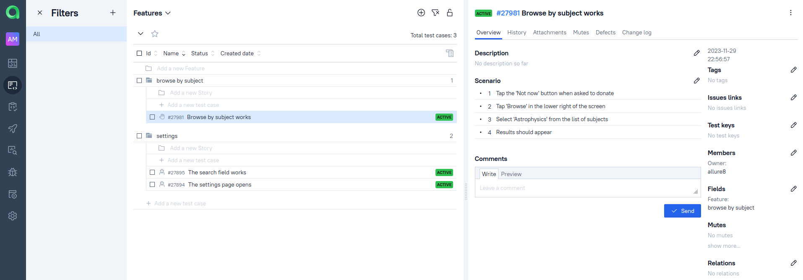
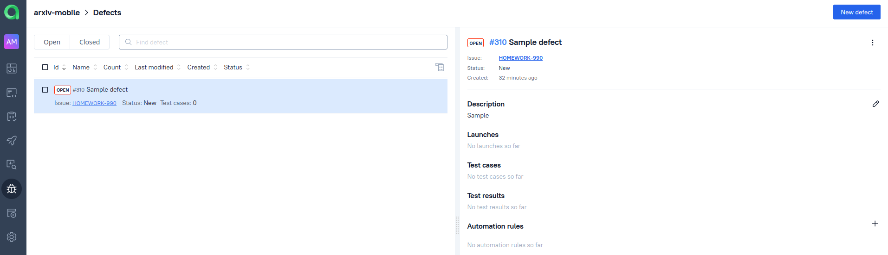
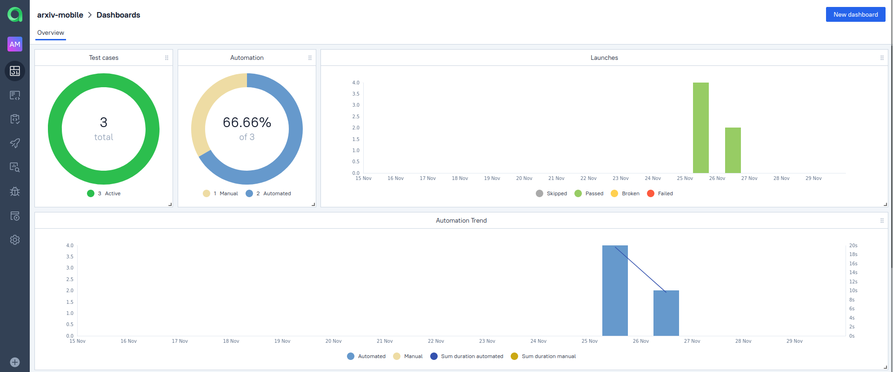

# ПРИМЕР ПРОЕКТА ПО ТЕСТИРОВАНИЮ  МОБИЛЬНОГО ПРИЛОЖЕНИЯ [ARXIV EXPLORER](https://github.com/GarrettBeatty/arXiv-eXplorer)

ArXiv - сайт, на котором с начала 1990х годов выкладывают в открытом доступе статьи по естественным наукам. ArXiv eXplorer - мобильное приложение для этого сайта под Android. Скачать приложение можно [здесь](https://f-droid.org/en/packages/com.gbeatty.arxiv/).

   

В двух словах:


## Покрытый функционал:

- Первая страница мобильного приложения 
- Поиск

В [отдельном проекте](https://github.com/rattus-aristarchus/test-arxiv) лежат тесты для самого сайта arXiv.

## Стек технологий:


## Локальный запуск

Для запуска тестов на своей машине необходимо:

- клонировать репозиторий `https://github.com/rattus-aristarchus/test_arxiv_mobile.git`
- создать файл `.env` с переменными среды. Файл должен содержать следующие переменные:
```
BROWSERSTACK_LOGIN=логин для browserstack
BROWSERSTACK_PASSWORD=пароль для browserstack
```
- выполнить следующие команды в корневой папке проекта:
```sh
python -m venv .venv
source .venv/bin/activate
pip install poetry
poetry update
pytest tests
```


## Удаленный запуск

Существует [проект Jenkins](https://jenkins.autotests.cloud/job/007-niknal-arxiv-mobile/), выполняющий тесты из этого репозитория. Чтобы запустить в нём тесты, необходимо:
- открыть проект
- нажать "Build now"
- нажать "Build"


### Отчеты в Allure Report

Проект Jenkins интегрирован с Allure Report. После выполнения джобы можно сразу перейти к отчёту по ней:


Подробное отображение выполнения каждого теста можно найти в разделе "Suites":


### Отчеты в Allure Testops

Проект Jenkins так же интегрирован с [проектом Allure Testops](https://allure.autotests.cloud/project/3848/dashboards), который хранит результаты всех прошлых запусков. Зачем? Чтобы иметь:

- отображение ручных и автоматизированных тест-кейсов в одном интерфейсе, с представлением их общего покрытия функциональности:


- дефекты, помогающие быстро сортировать ошибки в тестах:


- общую статистику выполнения:


### Jira

Проект в Allure Testops интегрирован с Jira. Задачи в Jira привязаны к тестам в Testops.


